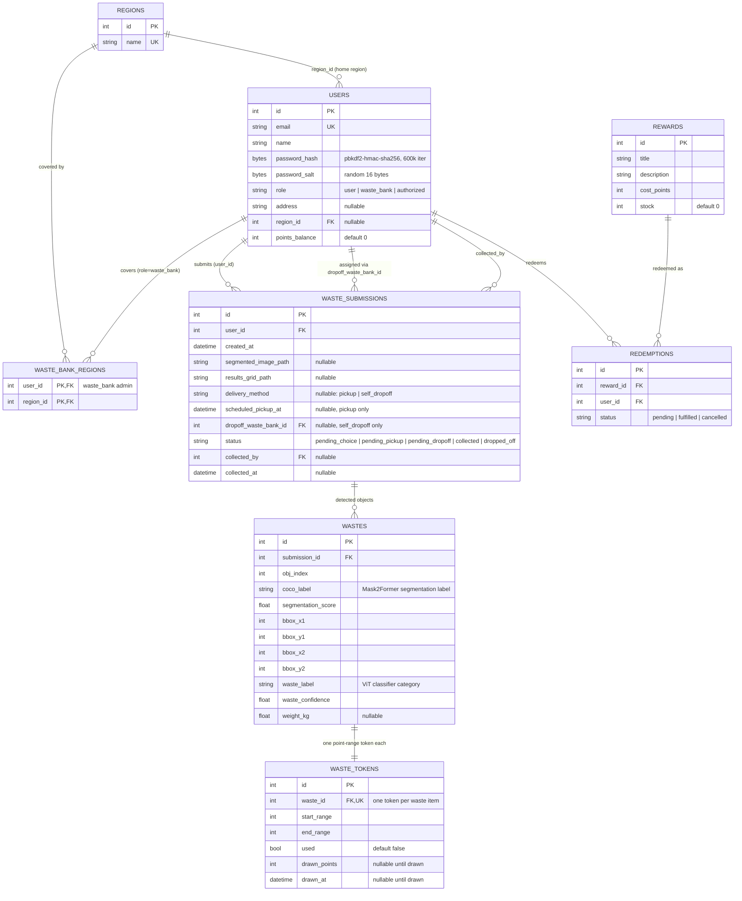

# ER Diagram

Source of truth: [`src/backend/app/db.py`](../src/backend/app/db.py) (SQLAlchemy Core `Table` definitions,
no ORM). Tables are created by `init_db()` at API startup.

## Notes

- **`waste_bank_regions`** is a pure many-to-many join table (composite primary key, no surrogate `id`):
  a `waste_bank` admin can cover multiple regions, and a region can (in principle) have more than one
  covering admin.
- **`users` has three FKs pointing back at itself** from `waste_submissions`: the submitter (`user_id`),
  the waste bank a self-dropoff was routed to (`dropoff_waste_bank_id`), and whoever performed the
  collection/dropoff confirmation (`collected_by`, which can be a `waste_bank` or `authorized` account).
- **`wastes` is one row per detected object**, not a JSON blob on the submission — each item is
  independently segmented, classified, and (via `waste_tokens`) earns its own point-range ticket.
- **Points are lazy-credited.** A `waste_tokens` row is a "lottery ticket": `points_balance` on `users`
  only changes when the user calls `POST /waste/tokens/{id}/draw`, which atomically marks the token
  `used` and adds a random value in `[start_range, end_range]` (see
  `app/services/rewards_policy.py`) to their balance.
- **CHECK constraints enforce the enums** at the DB level: `users.role`,
  `waste_submissions.status`, and `waste_submissions.delivery_method` — see the state diagram in
  [user-journeys.md](user-journeys.md) for how `status` actually transitions.
- **`rewards` / `redemptions` are a working skeleton**: `GET /rewards` currently always returns `[]`
  (no seed/admin-create endpoint yet), but `POST /rewards/redeem` already does the full
  balance-check → deduct → decrement-stock → record-redemption transaction.
