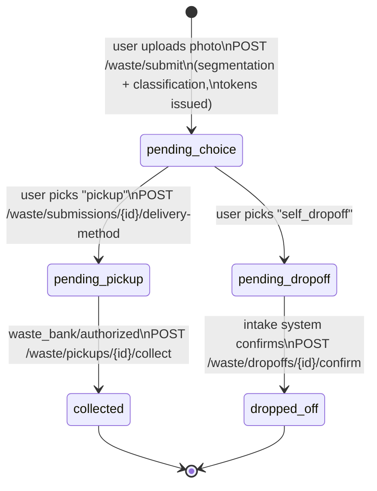
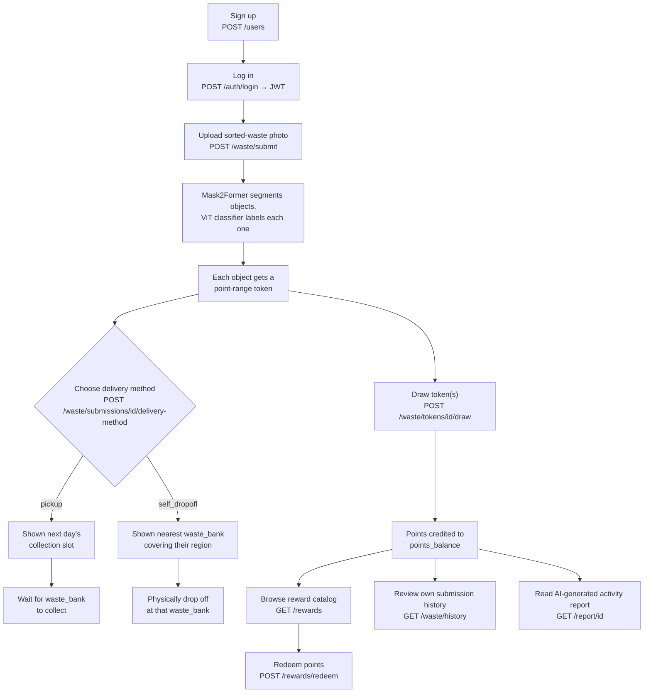
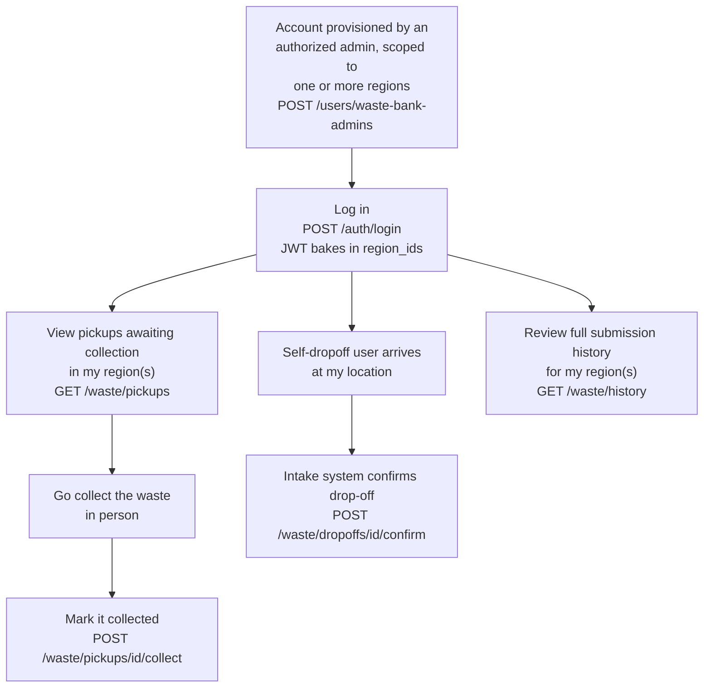
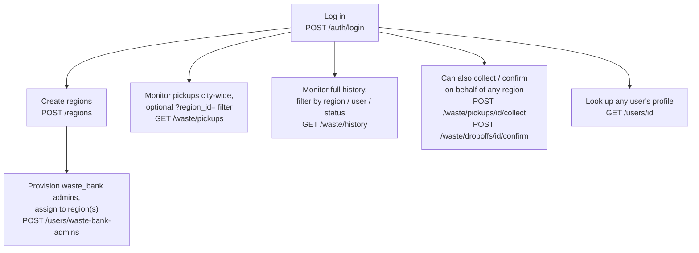

# Flowcharts & User Journeys

Pilahin has three account roles, enforced via `role` on `users` (`app/api/deps.py::require_roles`):

| Role | Who | Provisioned by |
|---|---|---|
| `user` | Household / individual submitting waste | Public self-signup (`POST /users`) |
| `waste_bank` | *Bank sampah* operator / pickup staff, scoped to one or more regions | An `authorized` account (`POST /users/waste-bank-admins`) |
| `authorized` | Program admin, city/organization-wide oversight | Bootstrapped out-of-band (`scripts/create_admin.py`) |

Maps to the three planned frontends: `src/frontend/household`, `src/frontend/waste_bank`, `src/frontend/whole`.

## Submission lifecycle (all roles touch this)

Every waste submission moves through one status machine, enforced by a DB `CHECK` constraint on
`waste_submissions.status`:

## 1. User (household) journey

Note: as implemented, drawing a token (`K`) isn't gated on the submission actually being collected or
dropped off — it only checks that the caller owns the token. So a user can draw their points as soon as
a submission is scored, independent of where steps `G`–`J` are in progress.

## 2. Waste bank (operator) journey

`GET /waste/dropoffs/{id}/confirm` is meant to be triggered automatically by an intake device (e.g. a
QR/badge scan at the bin), not clicked manually by staff — see the docstring on
`confirm_dropoff` in [`app/api/routes/waste.py`](../src/backend/app/api/routes/waste.py).

## 3. Authorized (program admin) journey

`authorized` is a superset of `waste_bank`'s permissions on the waste workflow (unscoped by region),
plus the only role that can create regions and provision `waste_bank` accounts.
